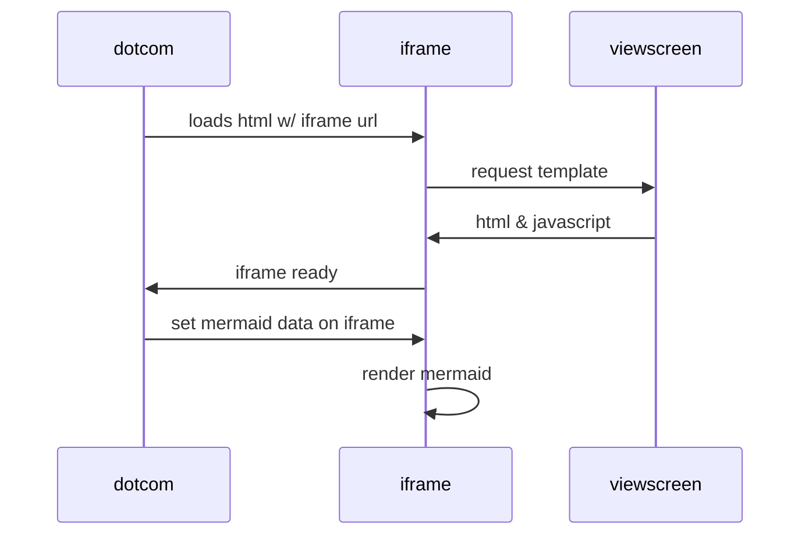

# Cojuntos

## Noções de conjuntos 
  - Conjunto 
  - Elemento 
  - pertinência 

## Conjunto 
  
> Um conjunto é uma repersentação de uma coleção de 
  elementos agrupados por uma determidada cracteristica.

### Representão de um conjunto 

**Conjunto das vogais**
  $A$ = { a, e, i, o, u} **conjunto finito**

**Conjunto dos números naturais**
  $A$ = {1, 2, 3, 4, 5, 6 ...} **conjunto infinito**

**Diagrama de Euler-Venn**


````

````


  
